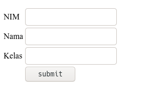
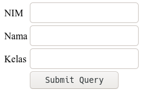
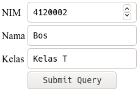
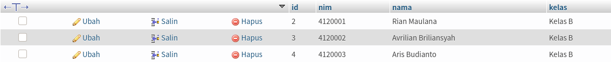
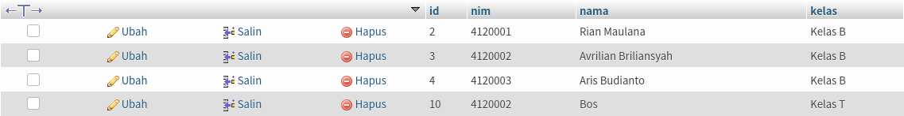
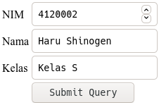
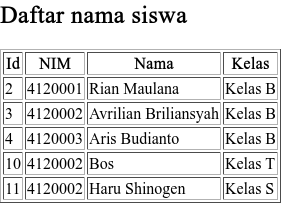
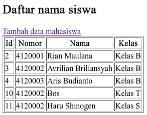

## Membuat Form

Form di html diguanakan untuk menginputkan data.
Bentuk form yang akan kita buat terlihat seperti berikut: 
	


Untuk melakukannya kita memerlukan 3 jenis input: `text`, `number`, dan `submit`.

Input dengan type `number` digunakan untuk menginputkan angka, type `text` untuk teks, dan `submit`
untuk mengirim data yang sudah kita input.

Letakan kode ini di dalam body di file **tambah.html**.

Dan semua itu kita masukan dalam tag form:

```html
<form action="">
	<input type="number">
	<input type="text">
	<input type="text">
	<input type="submit">
</form>
```

Kode diatas akan menghasilkan tampilan kurang lebih seperti berikut:


Kurang menarik bukan? 

Mari kita taruh elemen-elemen tersebut dalam tabel agar menjadi lebih rapi.
Dan kita beri teks untuk melabeli input kita.

```html
<form action="">
	<table>
		<tr>
			<td>NIM</td>
			<td><input type="number"></td>
		</tr>
		<tr>
			<td>Nama</td>
			<td><input type="text"></td>
		</tr>
		<tr>
			<td>Kelas</td>
			<td><input type="text"></td>
		</tr>
		<tr>
			<td></td>
			<td><input type="submit"></td>
		</tr>
	</table>
</form>
```

Hasilnya kurang lebih seperti berikut:



Untuk memproses data yang dimasukkan, kita akan membuat file baru **aksi.php**.
Pertama, Kita perlu untuk membuat koneksi ke database:

```php
<?php
	
	// disini kita menggunakan database 'pemwebb'
	$koneksi = mysqli_connect('localhost', 'root', '', 'pemwebb')

?>
```

Agar nilai dari input dapat 'ditangkap' saat tombol submit ditekan,
maka kita perlu mengubah aksi dari form ke **aksi.php**, mengatur 
methodnya menjadi post, dan memberi nama pada setiap input: 

```html
<form action="aksi.php" method="POST">
	<table>
		<tr>
			<td>NIM</td>
			<td><input type="number" name="nim"></td>
		</tr>
		<tr>
			<td>Nama</td>
			<td><input type="text" name="nama"></td>
		</tr>
		<tr>
			<td>Kelas</td>
			<td><input type="text" name="kelas"></td>
		</tr>
		<tr>
			<td></td>
			<td><input type="submit"></td>
		</tr>
	</table>
</form>
```

Kemudian kita akan menangkap nilai dari input di **aksi.php**
Untuk mengakses nilai yang kita masukan ke input kita
mengaksesnya di `$_POST['nama-input']`.

Karena kita menamai input kita dengan nama "nim" untuk input berupa 
nim, "nama" untuk input berupa "nama" dan "kelas" untuk input berupa
"kelas", maka kita perlu mengaksesnya
dari `$_POST` dengan nama tersebut:

```php
<?php
	
	// disini kita menggunakan database 'pemwebb'
	$koneksi = mysqli_connect('localhost', 'root', '', 'pemwebb');

	$nim = $_POST['nim'];
	$nama = $_POST['nama'];
	$kelas = $_POST['kelas'];

	// kita akan coba meng echo kan untuk melihat kalau ini semua bekerja 

	echo $nim;
	echo $nama;
	echo $kelas;
?>
```

Kita akan mencoba menginputkan di form:



Kemudian kita tekan tombol submit dan hasilnya akan menjadi seperti ini:


Yang perlu kita lakukan selanjutnya adalah menyimpan data yang sudah kita
inputkan ke dalam database:

Syntax untuk memasukan data ke tabel yang ada di database adalah:

```sql
INSERT INTO nama_tabel (kolom_1, kolom_2, kolom_3) VALUES (nilai_untuk_kolom1, nilai_untuk_kolom2, nilai_untuk_kolom2)
```

Karena tabel saya seperti ini

|id|nim|nama|kelas|
|:-:|:-:|:-:|:-:|

Dan saya hanya perlu memasukan data ke kolom, *nim*, *nama*, dan *kelas*, 
maka query saya adalah

```sql
INSERT INTO tablesiswa (nim, nama, kelas) VALUES (4120002, 'Bos ', 'Kelas T')
```
Saya tidak memasukan data ke kolom *id* disini dikarenakan kolom *id* sudah menerapkan
**AUTO_INCREMENT**

Untuk menggunakan data yang kita dapatkan dari form untuk disimpan ke database adalah

```php
<?php
	
	// disini kita menggunakan database 'pemwebb'
	$koneksi = mysqli_connect('localhost', 'root', '', 'pemwebb');

	$nim = $_POST['nim'];
	$nama = $_POST['nama'];
	$kelas = $_POST['kelas'];

	mysqli_query($koneksi, "INSERT INTO tablesiswa (nim, nama, kelas) VALUES ($nim, '$nama', '$kelas')");
?>
```

Kita akan coba membuktikan kalau kode diatas bekerja

1. Pertama kita akan mengecek kondisi tabel sebelum submit

	

2. Kemudian kita akan memasukan data kemudian memgeklik tombol submit

	

3. Kemudian kita lihat kembali kondisi tabel dengan merefresh terlebih dahulu

	

	Berhasil, YEAH!

Yang perlu kita lakukan selanjutnya adalah menampilkan data setelah kita melakukan
penyimpanan ke database.

Kita bisa melakukannya dengan mengarahkan halaman web ke halaman yang digunakan
untuk menampilkan data, dalam hal ini saya sudah mempunyai **table.php** yang
diguanakan untuk menampilkan data dari database.

Untuk mengarahkannya kita menggunakan:

```php
header('location:alamat')
```

Dikarenakan disini saya menggunakan **table.php** maka syntax saya adalah

```php
<?php
	
	// disini kita menggunakan database 'pemwebb'
	$koneksi = mysqli_connect('localhost', 'root', '', 'pemwebb');

	$nim = $_POST['nim'];
	$nama = $_POST['nama'];
	$kelas = $_POST['kelas'];

	mysqli_query($koneksi, "INSERT INTO tablesiswa (nim, nama, kelas) VALUES ($nim, '$nama', '$kelas')");

	header('location:table.php')
?>
```

Mari kita coba:

1. Masukan data dan klik submit

	

2. Kemudian kita akan melihat halaman **table.php**

	

Langkah terakhir adalah membuat link di **table.php** agar kita mudah mengakses **tambah.html**

```html
	<a href="tambah.html">Tambah data mahasiswa</a>
```

di **table.php**:

```php
<?php
$koneksi = mysqli_connect("localhost", "root", "", "pemwebb");
?>
<!DOCTYPE html>
<html lang="en">
<head>
	<meta charset="UTF-8">
	<title></title>
</head>
<body>
	<h2>Daftar nama siswa</h2>
	<a href="tambah.html">Tambah data mahasiswa</a>
	<table border="1">
		<tr>
			<th>Id</th>
			<th>Nomor</th>
			<th>Nama</th>
			<th>Kelas</th>
		</tr>
		<?php
		$ambildata = mysqli_query($koneksi, "SELECT * FROM tablesiswa");
		while ($data = mysqli_fetch_assoc($ambildata)) { ?>
			<tr>
				<td><?= $data['id']; ?></td>
				<td><?= $data['nim']; ?></td>
				<td><?= $data['nama']; ?></td>
				<td><?= $data['kelas']; ?></td>
			</tr>
		<?php } ?>
	</table>
</body>
</html>
```

Hasilnya:


