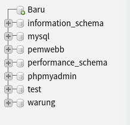
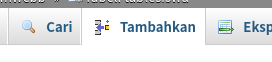

## table.php

Pertama siapkan html untuk table.php

```html
<!DOCTYPE html>
<html lang="en">
<head>
	<meta charset="UTF-8">
	<title></title>
</head>
<body>
	<h2>Daftar nama siswa</h2>
	<table border="1">
		<tr>
			<th>Id</th>
			<th>Nomor</th>
			<th>Nama</th>
			<th>Kelas</th>
		</tr>
	</table>
</body>
</html>
```

Kemudian kita akan membuat koneksi dengan apache server.
Pastikan sudah menyalakan apache dan mysql.

Disini saya misalkan akan memakai database *pemwebb*.
Kita akan membuat databasenya nanti.

```php
<?php
$koneksi = mysqli_connect("localhost", "root", "", "pemwebb");
?>
```

Kemudian kita akan membuat query untuk mendapatkan data dari database.

Disini saya menggunakan table **tablesiswa** yang ada di database.

```php
<?php
$koneksi = mysqli_connect("localhost", "root", "", "pemwebb");
?>
<!DOCTYPE html>
<html lang="en">
<head>
	<meta charset="UTF-8">
	<title></title>
</head>
<body>
	<h2>Daftar nama siswa</h2>
	<table border="1">
		<tr>
			<th>Id</th>
			<th>Nomor</th>
			<th>Nama</th>
			<th>Kelas</th>
		</tr>
		<?php
		$ambildata = mysqli_query($koneksi, "SELECT * FROM tablesiswa");
		?>
	</table>
</body>
</html>
```

Langkah selanjutnya adalah menjalankan query dan menampilkan data ke tabel.

```php
<?php
$koneksi = mysqli_connect("localhost", "root", "", "pemwebb");
?>
<!DOCTYPE html>
<html lang="en">
<head>
	<meta charset="UTF-8">
	<title></title>
</head>
<body>
	<h2>Daftar nama siswa</h2>
	<table border="1">
		<tr>
			<th>Id</th>
			<th>Nomor</th>
			<th>Nama</th>
			<th>Kelas</th>
		</tr>
		<?php
		$ambildata = mysqli_query($koneksi, "SELECT * FROM tablesiswa");
		while ($data = mysqli_fetch_assoc($ambildata)) { ?>
			<tr>
				<td><?= $data['id']; ?></td>
				<td><?= $data['nim']; ?></td>
				<td><?= $data['nama']; ?></td>
				<td><?= $data['kelas']; ?></td>
			</tr>
		<?php } ?>
	</table>
</body>
</html>
```

## mysql

Sekarang adalah saatnya menyetup mysql.

1. Pertama kita klik baru pada sidebar.

	

2. Kemudian kita beri nama database baru kita dengan nama bebas; disini saya memakai nama **pemwebb**.
Jika sudah kemudian klik buat.

	

3. Kemudian kita klik nama database kita tadi di sidebar.

	

4. Kemudian kita akan membuat tabel baru.
Masukan nama tabel dan jumlah kolom; disini saya memasukan nama **tablesiswa**.

	

5. Kita kemudian masukan nama kolom, tipe datanya (jenis) dan panjangnya.

	

6. Kemudian kita scroll ke kiri dan buat kolom id (paling atas) indeks menjadi **PRIMARY**
dan centang pada **A_I** (Auto Increment).

	

7. Kemudian klik simpan

	

8. Kemudian klik tabel **tablesiswa** pada sidebar.

	

9. Klik tambahkan di tab atas.

	

10. Sekarang kita masukan data siswa ke table dengan cara seperti ini.
Kita boleh mengosongi kolom id.

	

Jika semua itu sudah dilakukan maka kita bisa menampilkan table.php di browser
dan tablenya akan ditampilkan dengan data yang diambil dari database.
