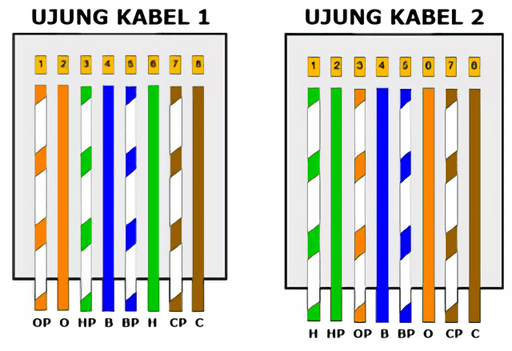

- **Nama**: Avrilian Briliansyah
- **NIM**: 4120002

## Soal

### 1.	Jelaskan Apa Yang di Maksud dari Jaringan Komputer menerut pemahaman Anda?

Jaringan yang menghubungkan 2 komputer atau lebih yang memungkinkan perangkat yang terhubung dapat berkomunikasi dengan satu sama lain.

### 2.	Sebut dan jelaskan Manfaat dari Implementasi Jaringan Komputer?

1. Berbagi File - Komputer yang terhubung ke jaringan bisa membagikan file yang ia punya atau juga bisa mengakses file dari komputer lain yang sudah dibagikan.
2. Berbagi Resource - Komputer yang terhubung ke jaringan dapat mengakses resource yang telah dibagikan (misal printer) atau juga bisa membagikan resource yang ia punya.
3. Berbagi Koneksi Internet - Komputer yang terhubung ke jaringan sudah terhubung ke internet dapat juga mendapat koneksi ke internet jika ia terhubung ke jaringan tersebut.

Referensi: <https://www.nibusinessinfo.co.uk/content/benefits-computer-networks>

### 3.	Jika Anda seorang network Administrator dalam suatu Perusahaan, topologi seperti apa yang akan anda gunakan dan mengapa anda memilih hal tersebut?

**Topologi Tree**
Alasan utama menggunakan topologi ini adalah untuk mengembangkan topologi bus dan topologi star.
Dengan format hirearki ini, memudahkan untuk menambah node ketika kebutuhan organisasi meningkat.
Format ini juga memudakan troubleshooting karena masalah dapat di cek secara sistematis di topologi ini.

Referensi: <https://www.comparitech.com/net-admin/network-topologies-advantages-disadvantages/>

### 4.	Sebutkan 5 Perangkat jaringan dan fungsinya?

1. **Router**

	Router adalah sebuah perangkat yang berfungsi untuk menghubungkan dua jaringan atau lebih sehingga pengiriman data dari satu perangkat ke perangkat lain bisa diterima.

2. **Bridge**

	Perangkat Bridge ini berfungsi untuk memperluas jaringan ke bentuk jaringan lain yang lebih luas sehingga bisa dipergunakan pada perangkat lain.

3. **Switch**

	Switch merupakan sebuah hardware yang fungsinya hampir sama dengan HUB, ia bisa membagi-bagi jaringan lokal ke banyak perangkat komputer. 
	Sementara fungsi utamanya switch ini ialah untuk menerima sinyal, mengirimkan data jaringan dari server ke jaringan perangkat lain.

4. **Perangkat LAN Card**
	
	Seperti halnya dengan perangkat jaringan yang lain, LAN Card ini merupakan perangkat jaringan yang dapt menghubungkan kiriman data dari perangkat satu ke perangkat lainnya.

5. **Access Point**

	Access Point kegunaannya mirip dengan router.
	Namun Access Point memiliki fungsi yang sebenarnya ialah untuk memancarkan Wireless sinyal yang dipancarkan dari router untuk membuat jaringan WLAN. 

Referensi: <https://makinrajin.com/blog/perangkat-jaringan-komputer/>

### 5.	Sebutkan Media Transmisi Jaringan Komputer dan beserta penjelasannya?

1. Media Transmisi Terpandu
	
	Media transmisi terpandu adalah jaringan yang menggunkan sistem kabel atau wired.

	- Twisted Pair Cable
		
		Twisted pair cabel atau kabel pasangan berpilin merupakan media transmisi yang harganya paling murah dan banyak digunakan baik itu untuk komunikasi analog maupun digital.
		Kabel ini terdiri dari dua jenis yakni Shielded Twisted Pair (STP) dan Unshielded Twisted Pair (UTP).

	- Coaxial Cable

		Coaxial cable atau kabel koaksial merupakan jenis kabel yang menggunakan dua buah konduktor.

	- Serat Optik

		Serat optic atau fibre optic merupakan saluran transmisi yang terbuan dari kaca atau plastik di mana digunakan untuk mentransmisikan sinyal cahaya yang berasal dari suatu tempat ke tempat lainnya.

2. Media Transmisi Tidak Terpandu

	Twisted pair cabel atau kabel pasangan berpilin merupakan media transmisi yang harganya paling murah dan banyak digunakan baik itu untuk komunikasi analog maupun digital.

	- Gelombang Mikro (Microwave) 

		Gelombang mikro adalah jaringan yang menggunakan media transmisi radio gelombang pendek di mana panjang gelombangnya hanya dalam satuan cm saja.

	- Sistem Satelit

		Sinyal yang dikirimkan media transmisi stasiun gelombang mikro di bumi kemudian diterima oleh satelit di luar angkasa.

	- Sinar Inframerah

		Sinar inframerah adalah salah satu contoh dari media transmisi yang jaraknya dekat.

	- Sinar Laser

		Hampir sama dengan inframerah, sinar laser ini juga bersifat line of sight yang mampu membawa data atau sinyal.

Referensi: <https://haloedukasi.com/media-transmisi-jaringan-komputer>

### 6.	Gambarkan Model pengkabelan Jaringan komputer  untuk model  Cross – Over  dan untuk apa memakai model tersebut.

>	

Kabel model cross-over digunakan saat menghubungkan perangkat jaringan yang sejenis. Misal, Host dengan host, switch dengan switch, router dengan router, dsb.

Referensi: <https://masdzikry.com/urutan-kabel-straight-dan-cross-rj45/>
